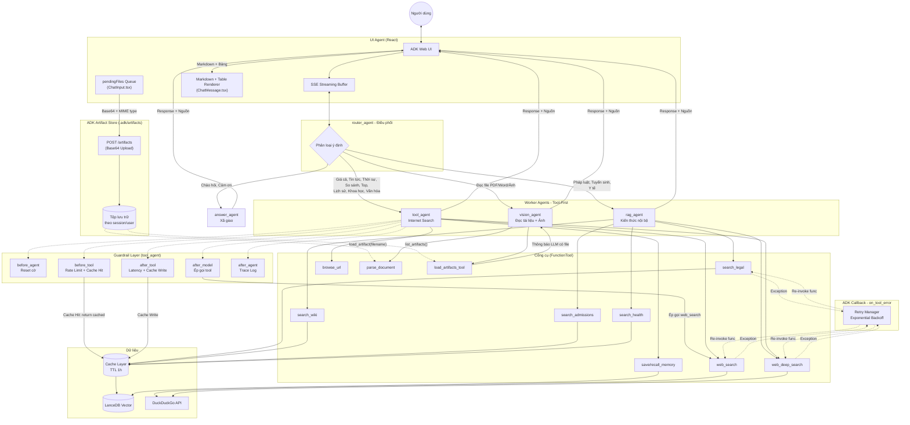
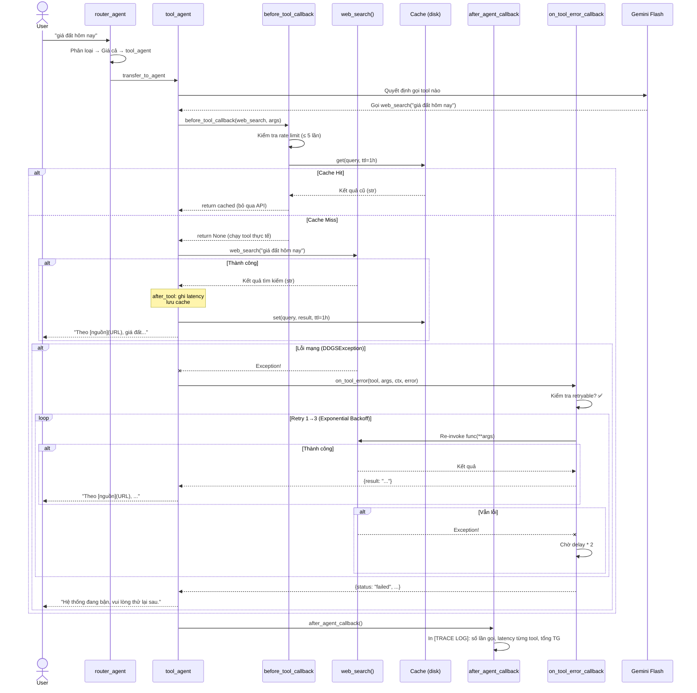
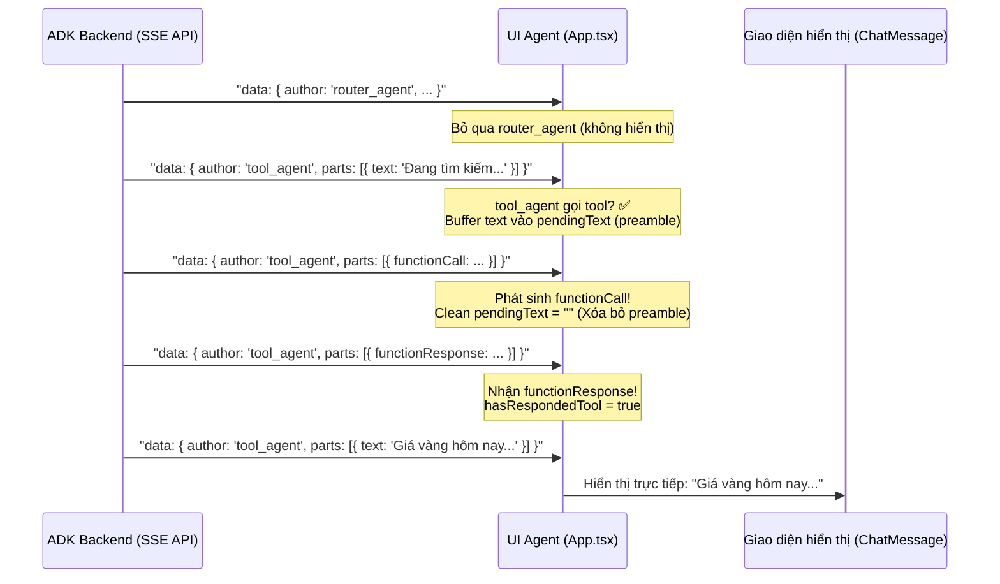

# X-Agent Architecture

## 1. Tổng quan

```
User → ADK Web → router_agent → [rag_agent | tool_agent | vision_agent | answer_agent] → User
     ↑
[File Upload] → POST /artifacts → ADK Artifact Store → vision_agent (load_artifacts_tool → parse_document)
```

`start_app.ps1` là launcher chính. `start_ui.ps1` chỉ là UI dev helper khi cần chạy React riêng.

**Cập nhật lần cuối:** 29/05/2026 — Đồng bộ auth server + launcher chính + file upload ADK

**Nếu đang học dự án lần đầu, nên đọc theo thứ tự này:**
1. `start_app.ps1` - biết hệ thống được khởi động thế nào.
2. `auth_server.py` và `my_agent/auth/router.py` - hiểu luồng đăng nhập/OTP/Google.
3. `my_agent/agent.py` - hiểu graph agent và cách tool được gắn vào.
4. `UI agent/src/app/App.tsx` - hiểu SSE stream và vòng đời UI.
5. `UI agent/src/app/providers/AuthProvider.tsx` - hiểu auth state trong browser.

---

## 2. Sơ đồ hệ thống



---

## 3. Luồng chi tiết (Request Flow)



---

## 4. Cấu hình Retry (ADK Callback)

| Tool | Max Retries | Base Delay | Backoff |
|------|-------------|------------|---------|
| web_search | 3 | 1.0s | ×2 |
| web_deep_search | 3 | 1.0s | ×2 |
| browse_url | 3 | 1.0s | ×2 |
| search_legal | 2 | 0.5s | ×2 |
| search_wiki | 2 | 0.5s | ×2 |
| search_admissions | 2 | 0.5s | ×2 |
| search_health | 2 | 0.5s | ×2 |
| save_memory | 2 | 0.5s | ×2 |
| recall_memory | 2 | 0.5s | ×2 |

**Retryable Exceptions:**
`ConnectionError`, `TimeoutError`, `OSError`, `DDGSException`, `RatelimitException`, `httpx.ConnectError`, `httpx.TimeoutException`

---

## 5. Key Features

1. **Tool-First Architecture**: Worker agents BẮT BUỘC gọi tool trước khi trả lời → chống hallucination.
2. **ADK Callback Retry**: `on_tool_error_callback` xử lý retry ở tầng framework, tool functions sạch sẽ.
3. **Hybrid RAG**: Vector Search + BM25 + Recency Boost.
4. **Deep Web Search**: Tự động đọc chi tiết top 3 trang web.
5. **Auto Escalation**: `web_search` rỗng → tự động gọi `web_deep_search`.
6. **Episodic Memory**: Phân loại ký ức (Profile, Preference, Reflection).
7. **Rate Limiting**: Chặn lần gọi tool > 5 lần/lượt tránh vòng lặp vô hạn.
8. **Web Search Cache**: Lưu kết quả `web_search`/`web_deep_search` vào disk cache TTL 1 giờ, tiết kiệm API call khi cùng query.
9. **Telemetry / Trace Log**: Mỗi lượt agent kết thúc in `[TRACE LOG]` tổng kết latency từng tool và tổng thời gian chạy.
10. **File Upload thực tế (ADK Artifacts)** *(mới)*: Người dùng đính kèm tệp tin → Frontend Base64 hóa và upload lên ADK Artifact Store qua `POST /artifacts` trước khi gửi câu hỏi. `vision_agent` dùng `load_artifacts_tool` để nhận diện tệp, sau đó gọi `parse_document` để trích xuất nội dung PDF/DOCX/TXT/CSV.
11. **Markdown & Bảng Premium Renderer** *(mới)*: `ChatMessage.tsx` tích hợp bộ parser thuần Regex, tự động convert bảng Markdown thô thành bảng HTML Premium (bo góc, bóng mờ, hàng xen kẽ màu, hover hiệu ứng). Hỗ trợ thêm: in đậm, in nghiêng, inline code, danh sách, tiêu đề phụ.

---

## 6. Source-of-Truth Files

| File | Vai trò |
|------|---------|
| `start_app.ps1` | Launcher chính |
| `auth_server.py` | FastAPI auth service (OTP + Google OAuth) |
| `my_agent/auth/router.py` | Auth endpoints, OTP policy, Google callback |
| `my_agent/auth/database.py` | SQLite users / OTP / OAuth state store |
| `my_agent/agent.py` | Định nghĩa Agents + Instructions + đăng ký `load_artifacts_tool` cho `vision_agent` |
| `my_agent/core/guardrail.py` | Lớp khiên chống Hallucination + Telemetry (**5 ADK Callbacks** cho `tool_agent`) |
| `my_agent/core/retry_manager.py` | ADK Callback retry (`on_tool_error`) |
| `my_agent/core/cache_manager.py` | Cache kết quả web search (TTL 1h, disk-based) |
| `my_agent/application/assistant_application.py` | Tool functions — `parse_document` dùng `tool_context.load_artifact()` (async, không hardcode path) |
| `my_agent/core/rag_engine.py` | Hybrid Search + Recency |
| `my_agent/modules/memory_module.py` | Categorized Memory |
| `my_agent/services/web_service.py` | Quick & Deep Web Search |
| `ui-agent/src/app/App.tsx` | Frontend SSE Streaming State Machine + File Upload (Base64 → `/artifacts`) |
| `ui-agent/src/app/components/AuthModal.tsx` | Modal đăng nhập / đăng ký / Google |
| `ui-agent/src/app/components/GoogleCallback.tsx` | Trang callback Google OAuth |
| `ui-agent/src/app/providers/AuthProvider.tsx` | Token / guest session / auth state trong browser |
| `ui-agent/src/app/components/ChatInput.tsx` | Khung nhập chat + hàng đợi file đính kèm (`pendingFiles`) với preview thumbnail |
| `ui-agent/src/app/components/ChatMessage.tsx` | Render tin nhắn + Markdown Parser + **Premium Table Renderer** |

---

## 7. Operational Notes

- **Launcher chính**: `.\start_app.ps1`
- **UI dev helper**: `.\start_ui.ps1` chỉ dùng khi cần chạy frontend React độc lập
- **Time Awareness**: AI được inject thời gian thực.
- **Citation Rule**: Bắt buộc trích dẫn `[Theo nguồn](URL)` trong mọi câu trả lời.
- **Hot Folder**: Thả file vào `hot_folder/<topic>/` để AI tự học.

---

## 8. Frontend SSE Streaming Architecture

Giao diện React hứng luồng dữ liệu Server-Sent Events (SSE) `/api/run_sse` thông qua cơ chế đọc stream của trình duyệt, được cấu trúc như sau:



**Tính Năng Nổi Bật:**
1. **Preamble Removal**: Ngăn chặn các câu mồi/rào đón rườm rà của mô hình ngôn ngữ lớn (ví dụ: *"Để tôi tra cứu..."*) hiển thị lên UI, mang lại trải nghiệm gọn gàng, tập trung.
2. **Multi-Agent State Separation**: Mỗi Agent (`author`) có một State riêng độc lập, tránh xung đột dữ liệu và giúp việc chuyển đổi hiển thị luồng giữa các Agent vô cùng mượt mà.
3. **No UI Freezing**: Cơ chế đệm và xả buffer thông minh triệt tiêu hoàn toàn lỗi kẹt UI hoặc treo hiển thị `"..."` thường thấy ở các giải pháp streaming thông thường.
