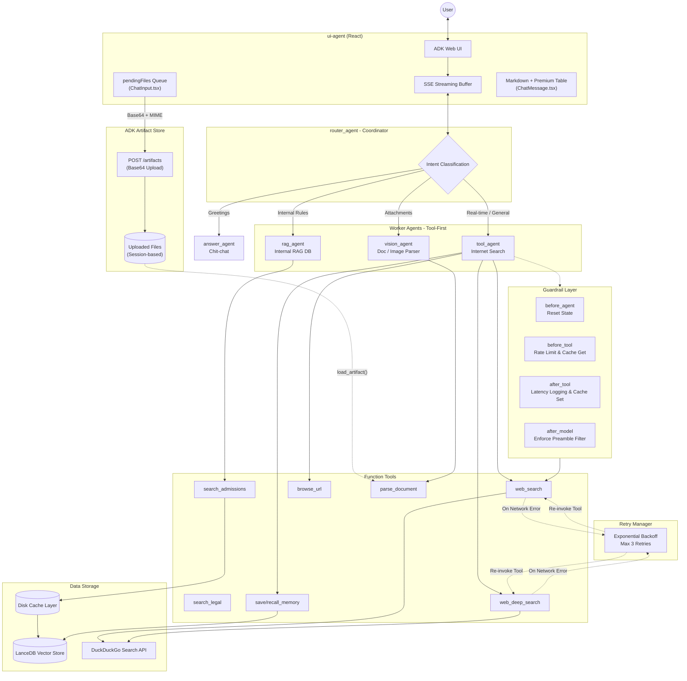

# X-Agent: Multi-Agent Admissions & University Knowledge Assistant

X-Agent is an agentic AI assistant built on **Google ADK** (Agent Development Kit), combining a local **Hybrid RAG** engine (Vector + BM25 search) with real-time web search and secure document analysis. 

Designed for universities (e.g., Gia Dinh University - GDU), X-Agent assists students, parents, and administrative staff in looking up admissions criteria, course curricula, tuition fees, and administrative guidelines with high precision and low latency.

---

## 🌟 Key Features

* **Multi-Agent Orchestration:** Coordinated by a central `router_agent` that classifies user intent and routes queries to specialized sub-agents:
  * `rag_agent`: Handles structured admissions, academic rules, and internal guidelines.
  * `tool_agent`: Executes internet searches for real-time news, exchange rates, and external queries.
  * `vision_agent`: Performs OCR and document analysis on uploaded attachments (PDF, DOCX, CSV, Image).
  * `answer_agent`: Manages simple social greetings and casual chit-chat.
* **Hybrid RAG Engine:** Merges vector semantic search (SentenceTransformers/PhoBERT) with keyword matching (Rank-BM25) via **Reciprocal Rank Fusion (RRF)**. Includes a **Recency Boosting** algorithm that automatically prioritizes documents from the latest academic year.
* **Auto-Ingestion Pipeline (Hot Folder Watcher):** A real-time folder observer utilizing `watchdog` to monitor document drop zones, parse multiple file formats (PDF, Word, Excel, text-based Q&A templates), and automatically update vector databases.
* **Production-Grade Resilience:**
  * **Disk Cache (TTL 1h):** Caches web search queries to avoid redundant API calls and save tokens.
  * **Guardrail Callbacks:** Intercepts agent tool execution to enforce rate-limits (max 5 calls/turn) and prevent infinite agent loops or hallucinations.
  * **Resilient Retry Manager:** Built-in ADK callbacks handling connection errors with an **Exponential Backoff** retry strategy.
* **SSE Streamed React UI:** Features a high-fidelity React interface consuming Server-Sent Events (SSE) `/api/run_sse`. Integrates custom **preamble filtering** (removes LLM boilerplate text like *"Let me search that..."*) and a premium responsive **Markdown Table Renderer**.

---

## 🏗️ System Architecture



---

## 📁 Repository Map

```text
X-Agent
├── docs/                             # Academic reports & helper guides
│   ├── report.md                     # Research & development report (GDU admissions)
│   └── adk_help.txt                  # ADK troubleshooting guide
├── ui-agent/                         # React Frontend (Vite, TypeScript, Tailwind/CSS)
│   ├── src/app/App.tsx               # Main React controller, SSE socket state
│   ├── src/app/components/           # Chat input, messages, auth dialogs
│   └── package.json                  # Frontend dependencies
├── my_agent/                         # Core Multi-Agent backend
│   ├── agent.py                      # ADK Agent definition, routing logic
│   ├── application/                  # Tool function definitions (RAG, Web search)
│   ├── auth/                         # FastAPI Authentication modules (OTP, Google OAuth)
│   ├── core/                         # Guardrails, Hybrid RAG Engine, caching
│   ├── modules/                      # Domain modules (admissions, memory, general)
│   ├── services/                     # Web crawling and scraper services
│   └── data/                         # SQLite databases & local LanceDB tables
├── scripts/                          # Administration & ETL pipeline scripts
│   ├── auto_watcher.py               # Watchdog daemon for hot_folder ingestion
│   ├── organize_gdu_files.py         # 4-tier GDU file categorizer
│   └── ingest_gdu_classified.py      # Main ingestion parser (Word, Excel, PDF)
├── start_app.ps1                     # Main systems launcher (FastAPI, watcher, ADK)
├── start_ui.ps1                      # Frontend development launcher
├── auth_server.py                    # Entry point for FastAPI Auth Service
├── requirements.txt                  # Python dependencies
└── .gitignore                        # Git exclusions (credentials, large files)
```

---

## 🛠️ Setup & Installation

### Prerequisites
- Python 3.10+
- Node.js 18+
- OpenRouter API Key (to access Gemini Flash)

### 1. Backend Setup
1. Clone the repository:
   ```bash
   git clone https://github.com/your-username/x-agent.git
   cd x-agent
   ```
2. Create and activate a virtual environment:
   ```bash
   python -m venv .venv
   # Windows PowerShell:
   .venv\Scripts\Activate.ps1
   # Linux/macOS:
   source .venv/bin/activate
   ```
3. Install Python dependencies:
   ```bash
   pip install -r requirements.txt
   ```
4. Create your `.env` configuration file from the template:
   ```bash
   cp .env.example .env
   ```
   Open the `.env` file and insert your credentials (e.g. `OPENROUTER_API_KEY`, Brevo Credentials for Email OTP, and Google OAuth credentials).

### 2. Frontend Setup
1. Navigate to the frontend directory:
   ```bash
   cd ui-agent
   ```
2. Install dependencies:
   ```bash
   npm install
   ```

---

## 🚀 Running the Application

For a fully automated startup experience on Windows, you can use the provided PowerShell launch scripts.

### Step 1: Launch Backend Systems
Run the primary launcher script in PowerShell:
```powershell
.\start_app.ps1
```
This script automatically:
1. Spawns the **FastAPI Authentication Server** (port `8001`).
2. Activates the **Hot Folder Watchdog Daemon** (`auto_watcher.py`).
3. Starts the **ADK Web Service** (port `8000`).

### Step 2: Run the React UI Dev Server
In a separate terminal, launch the frontend dev server:
```powershell
.\start_ui.ps1
```
The React interface will run locally at `http://localhost:5173`. Open this URL in your web browser to interact with X-Agent.

---

## 📥 Ingestion & Data Setup

To load university data into the database:
1. Ensure the system is running (`start_app.ps1` is active).
2. Place your raw `.docx`, `.pdf`, or `.xlsx` files into their respective subdirectories within `hot_folder/` (e.g. `hot_folder/admissions`).
3. The watchdog daemon `auto_watcher.py` will instantly detect new files, split text into semantic chunks, generate embeddings, and store them inside the local LanceDB instance.
4. Alternatively, you can run automated ETL batch imports using the files in the `scripts/` directory:
   ```bash
   python scripts/organize_gdu_files.py
   python scripts/ingest_gdu_classified.py
   ```

---

## 📝 License
This project is licensed under the MIT License - see the LICENSE file for details.
